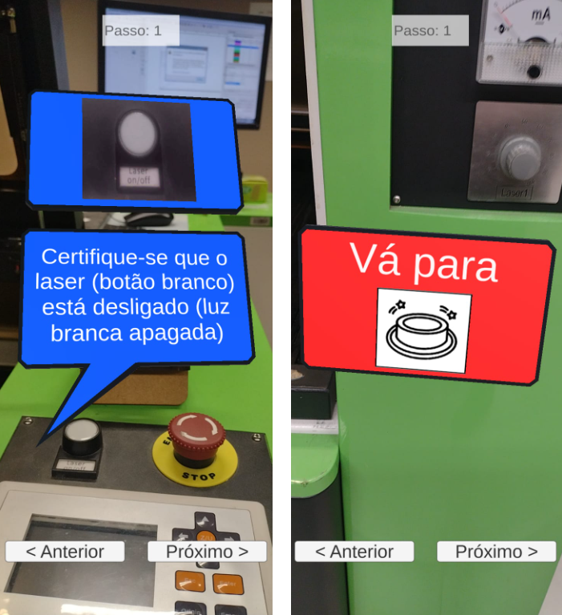
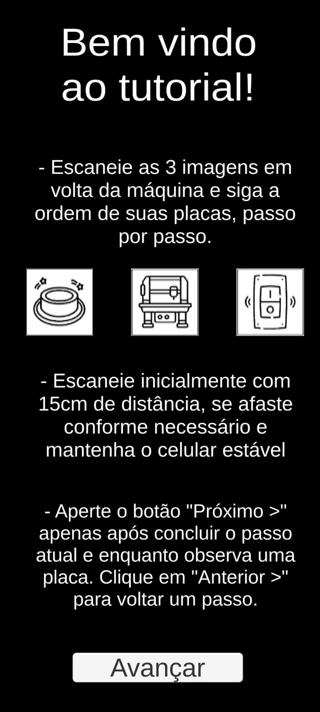
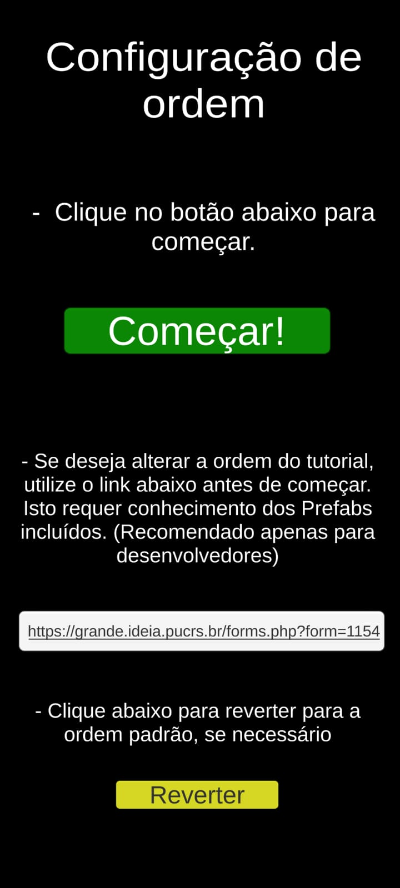
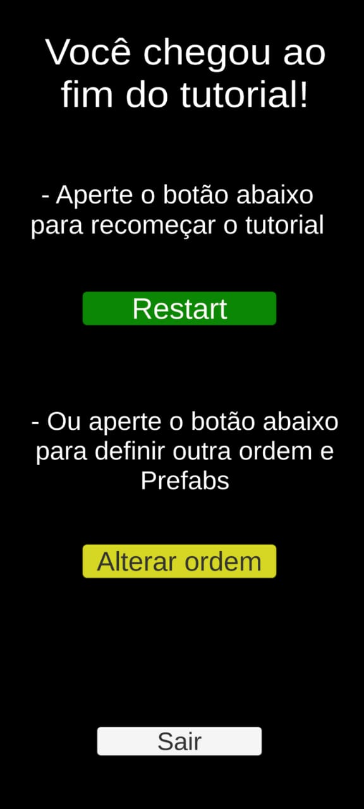

# ARGuide

---- PORTUGUÊS ----

Este projeto em Unity implementa um guia de operação de uma máquina de corte à LASER em Realidade Aumentada para dispositivos móveis, desenvolvido como o Trabalho de Conclusão de Curso
para o Bacharelado em Ciência da Computação na PUCRS. O algoritmo projeta prefabs sobre imagens especificadas de acordo com uma ordem definida pelo usuário, quando estas imagens são rastreadas
pela câmera do smartphone. As imagens, prefabs/modelos 3D e ordem podem ser facilmente alteradas na Unity, antes de build a apk. A ordem (um arquivo .txt) também pode ser modificada em runtime.

Os assets padrão incluídos na release foram feitos para uso específico no laboratório Fablab na PUCRS. Estes assets e os menus no momento estão em Português. A ordem padrão já inclusa pode ser revertida
ao normal em runtime no menu de "Configuração de Ordem". Há no momento uma release para sistemas Android, com planos para uma release para iOS no futuro.

Compatível com a versão 2022.3.8f1 da Unity e superiores.

Modelos de placas padrão: <a href="https://vtluma.carrd.co/" title="LuMa">LuMa</a>

Imagens padrão originais: <a href="https://www.flaticon.com/br/icones-gratis/diversos" title="diversos ícones">Diversos ícones criados por IconBaandar - Flaticon</a>
<a href="https://www.flaticon.com/br/icones-gratis/maquina" title="máquina ícones">Máquina ícones criados por Freepik - Flaticon</a>
<a href="https://www.flaticon.com/br/icones-gratis/interruptor" title="interruptor ícones">Interruptor ícones criados por Vector Clans - Flaticon</a>

---- ENGLISH ----

This Unity project implements an Augmented Reality LASER cutting machine operation guide for mobile systems, developed as the Final Paper for the Bacharel's Degree in Computer Science at PUCRS. 
The algorithm projects prefabs above specified images in accordance with a user defined order, whene these images are tracked by the smartphone's camera. The images, prefabs/3D models and order
can be easily altered in Unity, before building the apk. The order (a .txt file) can be modified at runtime as well.

The default assets included with the release were made for specific use at the Fablab laboratory at PUCRS. These assets and the menus are currently in Portuguese. The default order already included 
can be reverted back to normal  at runtime in the "Configuração de Ordem" menu. There is currently a release for Android systems, with plans for a future iOS release.

Compatible with Unity version 2022.3.8f1 and above.

Default plaque models: <a href="https://vtluma.carrd.co/" title="LuMa">LuMa</a>

Original default images: <a href="https://www.flaticon.com/br/icones-gratis/diversos" title="diversos ícones">Diversos ícones criados por IconBaandar - Flaticon</a>
<a href="https://www.flaticon.com/br/icones-gratis/maquina" title="máquina ícones">Máquina ícones criados por Freepik - Flaticon</a>
<a href="https://www.flaticon.com/br/icones-gratis/interruptor" title="interruptor ícones">Interruptor ícones criados por Vector Clans - Flaticon</a>

